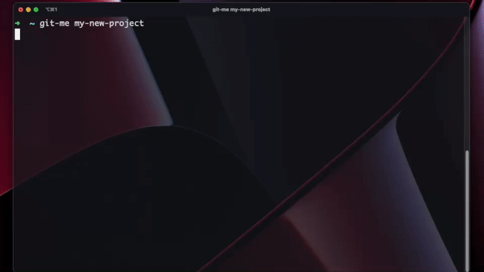

# What is this?
 <br/>
This is an automation. With one command, you will be able to create a new, blank local repository with your desired project name and also push it up to your remote github repository.

### We need these:
- Python3
- Xcode
- Github Personal Access Token (with <b>repo</b> and <b>delete_repo</b> scopes)

#### Don't have the stuff?
- https://docs.python-guide.org/starting/install3/osx
- https://github.com/settings/tokens/new
## Get me going!!

1. clone the repository
```bash
$ git clone https://github.com/aaronlamtran/create-project-github-automation.git
```

2. navigate into repository and copy the working directory to your clipboard for PATHTOGITHUBAUTO in step 6B
```bash
$ cd create-project-github-automation
```
```bash
$ pwd | pbcopy
```

3. install requirements
```bash
$ pip3 install -r requirements.txt
```

4. create your .env file. see template provided (.example.env)
```bash
$ touch .env
```


5. run bash script to initialize
```bash
$ source initialize.sh
```

6. (A) try it out! anytime we want to create a local and remote project, run command:
```bash
$ git-me <your desired new project name>
```
 - this will:
   - create your local repo
   - push to your remote repo
   - open up your local repo in vscode<br/>


6. (B) like what this automation does? to have the <b>git-me</b> command available on startup without having to run steps 4 and 5 after restart, add the following lines to your .bashrc or .zshrc file:
```bash
PATHTOGITHUBAUTO="<path-to: create-project-github-automation>"
source $PATHTOGITHUBAUTO/.env
source $PATHTOGITHUBAUTO/initialize.sh
```

7. YESSS! one less hurdle to jump through before building! enjoy!

